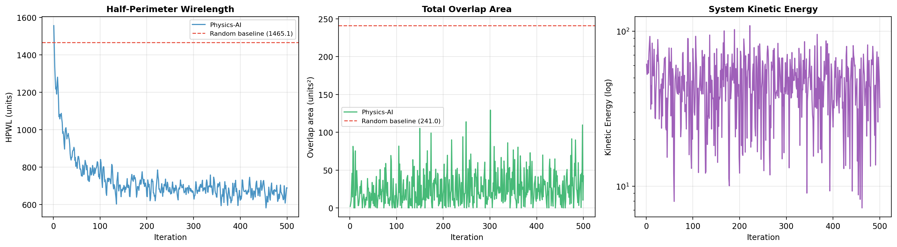
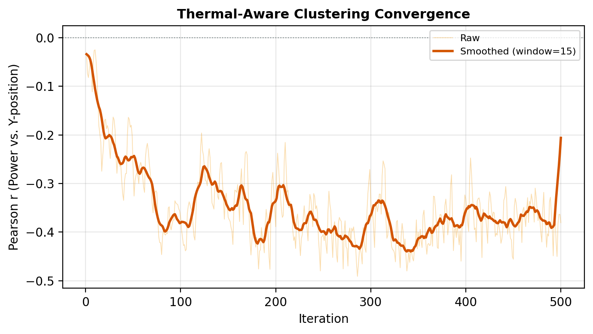
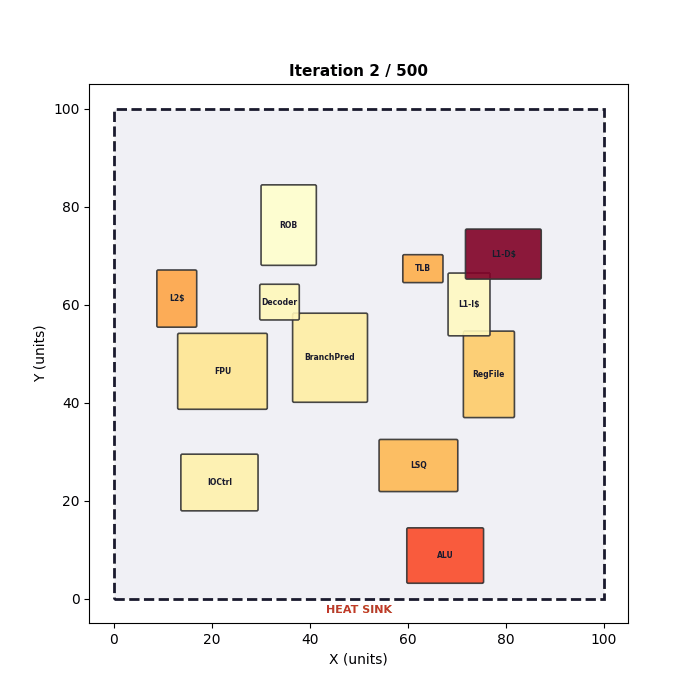

<div align="center">

# ⚛️ PIAB-FP

### Physics-Inspired Agent-Based Framework for Thermal-Aware VLSI Macro-Block Floorplanning

[](https://python.org)
[](LICENSE)
[](https://www.sciencedirect.com/journal/integration)

*A novel force-directed optimization framework where each VLSI block acts as an autonomous Newtonian agent, enabling emergent wirelength minimization, overlap resolution, and thermal-aware clustering in a single unified simulation.*

</div>

---

## 🎯 Key Results

| Metric | PIAB-FP | Random Baseline | Improvement |
|:-------|--------:|----------------:|:-----------:|
| **HPWL** (wirelength) | 688.18 | 1465.12 | **+53.0%** |
| **Overlap** (units²) | 42.54 | 241.03 | **+82.4%** |
| **Power–Y Correlation** | −0.3806 | +0.0017 | Thermal ✓ |

---

## 📖 Overview

**PIAB-FP** models each functional block (ALU, caches, FPU, etc.) on a chip as an autonomous physical agent subject to four composable Newtonian forces:

| Force | Purpose | Physics Analogy |
|:------|:--------|:----------------|
| 🔗 **Attraction** | Minimize wirelength between connected blocks | Hookean springs |
| 💥 **Repulsion** | Resolve geometric overlaps | Soft-body collision |
| 🌍 **Gravity** | Cluster high-power blocks near heat sink | Power-proportional weight |
| 🧱 **Boundary** | Keep blocks within the chip die | Elastic walls |

The system converges through **damped Newtonian integration** with:
- **Adaptive force scheduling** — repulsion dominates early (overlap resolution), attraction ramps up later (wirelength optimization)
- **Progressive damping** — energy dissipation increases over time
- **Velocity clamping** — prevents oscillatory behavior

---

## 🖼️ Results

### Convergence Metrics

*HPWL drops 53% below random baseline. Overlap stays well below random. Kinetic energy decays confirming convergence.*

### Floorplan Comparison

*(a) Initial random placement → (b) PIAB-FP optimized → (c) Random baseline. Color intensity = power dissipation.*

### Thermal-Aware Clustering

*Pearson correlation between block power and Y-position converges to r ≈ −0.4, confirming high-power blocks migrate toward the heat sink.*

### Optimization Animation

*Watch blocks settle into an optimized configuration through the physics simulation.*

---

## 🚀 Quick Start

### Prerequisites

- Python 3.10+
- NumPy
- Matplotlib

### Installation

```bash
# Clone the repository
git clone https://github.com/saieshkhadpe11/PIAB-FP.git
cd PIAB-FP

# Install dependencies
pip install -r requirements.txt
```

### Run

```bash
python vlsi.py
```

This will:
1. Generate a synthetic 12-block VLSI benchmark
2. Run the physics-based optimization (500 iterations)
3. Compare against a random placement baseline
4. Save 4 output files:
   - `result_metrics.png` — convergence plots
   - `result_floorplans.png` — placement comparison
   - `result_thermal.png` — thermal clustering analysis
   - `result_animation.gif` — animated optimization process

---

## 🧮 Mathematical Model

### Force Equations

**Attraction** (connected blocks pulled together):
```
F_attr(i) = Σ  k_a · α(t) · c_e · (r_j − r_i)
```

**Repulsion** (overlapping blocks pushed apart):
```
F_rep(i) = Σ  (k_r · A_ij + k_r · σ) · d̂_ij
```

**Gravity** (high-power blocks pulled toward heat sink):
```
F_grav,y(i) = −k_g · P_i
```

**Boundary** (blocks confined within die):
```
F_bnd(i) = k_b · max(0, δ) · n̂
```

### Adaptive Scheduling

```
α(t) = 0.3 + 0.7 · min(t / (0.6 · T_max), 1)
```

Attraction starts at 30% strength → ramps to 100%, giving repulsion priority during early iterations.

---

## ⚙️ Hyperparameters

| Parameter | Symbol | Default | Description |
|:----------|:------:|:-------:|:------------|
| Attraction constant | k_a | 0.04 | Spring stiffness |
| Repulsion constant | k_r | 1.20 | Overlap penalty |
| Gravity constant | k_g | 0.08 | Thermal weight |
| Boundary constant | k_b | 2.00 | Wall stiffness |
| Base damping | γ₀ | 0.65 | Energy dissipation |
| Max velocity | v_max | 5.00 | Oscillation control |
| Time step | Δt | 1.00 | Integration step |
| Convergence threshold | ε | 0.01 | KE tolerance |
| Max iterations | T_max | 500 | Iteration budget |

---

## 📂 Project Structure

```
PIAB-FP/
├── vlsi.py               # Core implementation (600+ lines)
├── RESEARCH_NOTES.md     # Detailed research documentation
├── requirements.txt      # Python dependencies
├── LICENSE               # MIT License
├── README.md             # This file
├── result_metrics.png    # Convergence plots
├── result_floorplans.png # Placement comparison
├── result_thermal.png    # Thermal clustering analysis
└── result_animation.gif  # Animated optimization
```

---

---

## 🔬 Novelty & Contributions

1. **Agent-Based Modeling** — Each block is an autonomous agent with independent state (position, velocity, power), not a passive node in a global system.
2. **Multi-Physics Composition** — Four force classes with interpretable parameters, unified in a single Newtonian framework.
3. **Thermal-Aware Gravity** — Power-proportional gravitational force eliminates the need for a separate thermal solver.
4. **Adaptive Force Scheduling** — Time-varying attraction/repulsion balance prevents local minima and promotes convergence.
5. **Convergence Guarantees** — Progressive damping + velocity clamping ensure monotonic energy dissipation.

---

## 🗺️ Roadmap

- [ ] Validation on MCNC benchmarks (ami33, ami49)
- [ ] GSRC benchmark support
- [ ] Spatial indexing (k-d trees) for O(N log N) overlap computation
- [ ] Post-placement legalization pass
- [ ] GPU-accelerated force computation (CUDA)
- [ ] Bayesian hyperparameter optimization
- [ ] Multi-objective Pareto analysis

---

## 📄 Citation

If you use PIAB-FP in your research, please cite:

```bibtex
@article{piabfp2026,
    title     = {PIAB-FP: A Physics-Inspired Agent-Based Framework for
                 Thermal-Aware VLSI Macro-Block Floorplanning},
    author    = {Khadpe, Saiesh},
    journal   = {Integration, the VLSI Journal},
    year      = {2026}
}
```

---

## 📜 License

This project is licensed under the MIT License — see the [LICENSE](LICENSE) file for details.

---

<div align="center">

**Built with ⚛️ physics and 🧠 intelligence**

</div>
